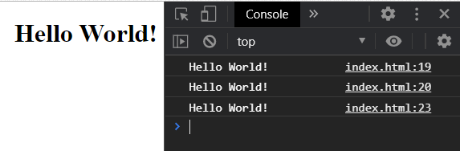
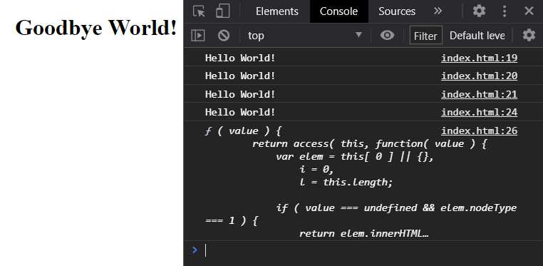
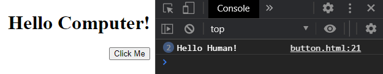

# jQuery101
## jQuery The Basic's explained and demonstrated

> Welcome to jQuery 101. In this section we will go over jQuery syntax along with a couple of examples. Such as rendering console logs and being able to change text content using inner HTML. 

## JQ vs JS

***What is the difference between JS & JQ?***

```

    - In javaScript we use document.notation('id')
    - In jQuery we use the $ symbol 
    - In JS we use . notation to grab our ID's and Classes
    - In JQ we use # and . symbol to grb our ID's and Classes

```


> The Web Browser and Console Log Should look like this:



- - -

***Changing Text Content***

> In this section we changed the Text Content on the HTML page


> The Web Browser and Console Log Should look like this:



- - -

***JQ Button***

> In this section we created a button using JQ

***figure 1***


***figure 2***


- - -

## LINKS

- [jQuery Link]()
- [Github Repo Link](https://github.com/nicholasd-uci/jQuery101)
- [Nicholas Dallas GitHub](https://github.com/nicholasd-uci)

- - -
© 2020 NPRD, Nicholas Paul Ruiz Dallas